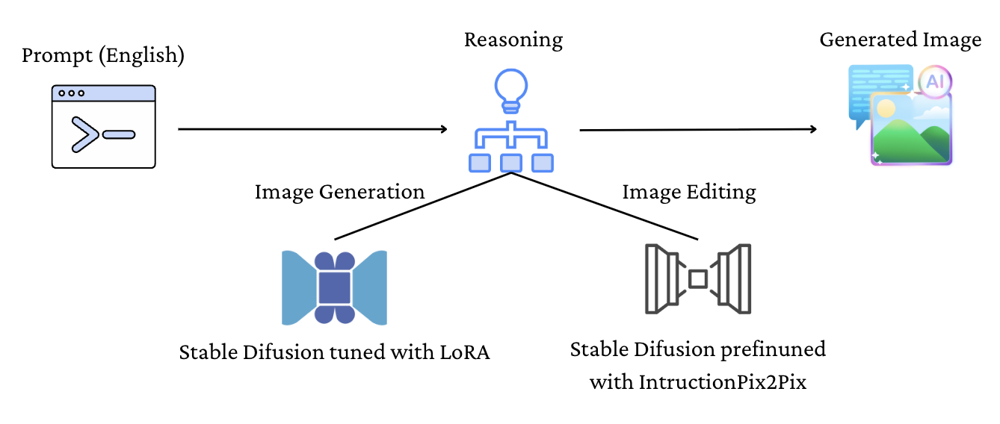

# 🎨 Davinci Agent — Multi-Modal Creative AI Agent

An advanced agent architecture that uses a language model to orchestrate tools and generate or edit images via diffusion models.



---

## Pipeline Overview

The agent system processes user queries and determines whether they are continuations of previous prompts. Based on that, it decides whether to use the **generation** or **editing** model.

* If the query is ambiguous, the LLM will ask clarifying questions.

* The prompt is then reformulated into a more suitable input for a diffusion model (e.g., removing phrases like “I want,” “please,” or vague phrasing like “why is the...” → “make it...”).

* For **generation**, a custom fine-tuned diffusion model is used.

* For **editing**, a checkpoint of the Stable Diffusion model fine-tuned with [InstructPix2Pix](https://github.com/timothybrooks/instruct-pix2pix) is employed.

---

## 📊 Dataset Strategy

### Generation Model

* A small custom dataset was created by generating **3 images per prompt** from a set of **30 prompts**.
* These images are scored using:

  * **Feedback score**
  * **CLIP score**
* The best versions are selected to refine the prompt and help with future fine-tuning.
* In deployment: (for future implementation) 

  * Multiple images are generated per prompt.
  * Users provide feedback.
  * High-scoring images (CLIP + user evaluation) are retained for a feedback loop of continuous fine-tuning.

### Editing Model

* Fine-tuned from InstructPix2Pix, which includes:

  * **450k image-edit pairs**
  * Edits generated using GPT-3 and the diffusion model itself.
  * All data filtered using a CLIP threshold for quality control.

---

## ✨ Features

* **🧠 Tool-Calling Agent**: Built with **LangGraph** and **LangChain**.
* **🎨 LoRA Fine-Tuning**: Based on curated image outputs via CLIP + feedback scoring.
* **🧠 Multi-Turn Reasoning**: Uses Chain-of-Thoughts to break down prompts.
* **🔍 DeepSeek**: Handles language understanding and tool coordination for complex tasks.

---

## ⚙️ Setup

```bash
pip install -r inference/requirements.txt
```

### Environment Setup

- Download [Ollama](https://ollama.com)  
- Run: `ollama pull llama3`  

You'll need API keys for:

* Cloudinary
* Ngrok

Add these to your `.env` file:

```env
LANGCHAIN_TRACING_V2=false
LANGCHAIN_PROJECT="Default Project"
LANGCHAIN_API_KEY=your_api_key_here
```

---
### How to run:
- Run the inference/fast_api.ipynb notebook after filling in all the necessary API keys.

- Get the URL from running fast_api.ipynb and set it as the BASE_URL in inference/app.py.

- Tip: Use GPU (e.g., on Kaggle) to maximize performance.

- Then run: `python inference/app.py`
